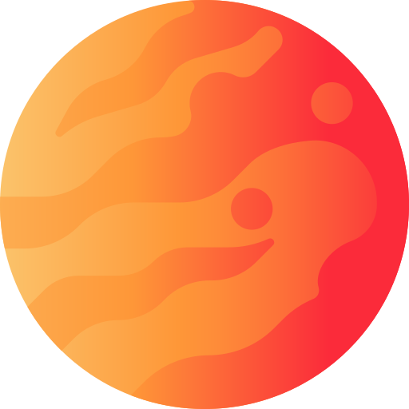

<h1 align='center'> 3D Planets destroyer 🌏</h1>
<h3 align='center'>Project with very tricky animated transition and 3D support that can help you visualize our solar system in details ☀️, and even zoom on the planets (textures from NASA)</h3>
 

 
 
 
 

<h2 align='center'>Videos about 3D in this site</h2>
 

## EN 🌝 [YouTube video - "I created sun"](https://www.youtube.com/watch?v=DbWTAG9pBoU)

## RU 🌚 [Видео на YouTube - Создаём Плутон](https://www.youtube.com/watch?v=H_OdNo4dxTE)
 

 
<h1 align='center'>Examples</h1>

## Todo

<ul>
<li> Solar system planets with textures three.js ✔
<li> transition router with animation ✔
<li> Background filter in every image ✔
<li> onClick top section hide? ✔
<li> Pluto ✔
<li> Sun ✔

<li> Refactor DRY

<li> Responsive design for phone

<li> TypeScript support

</ul>

### Demo - https://planet-destroyer.netlify.app/