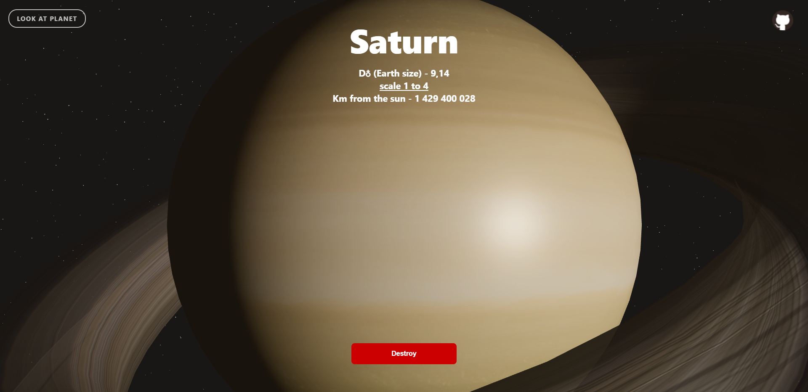
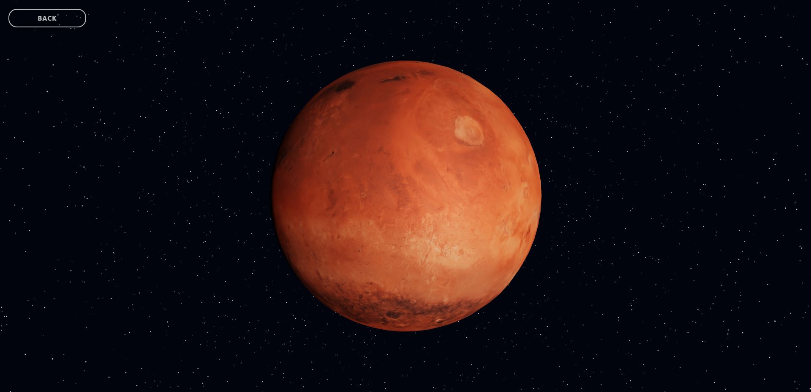
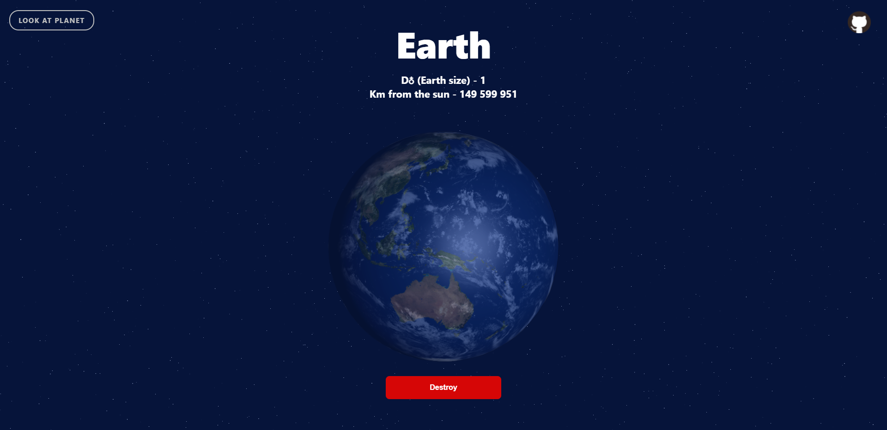
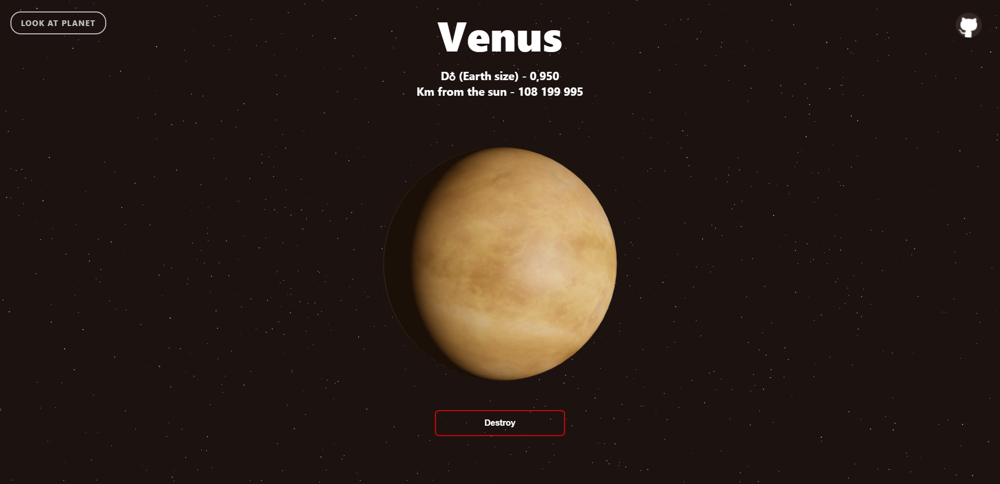
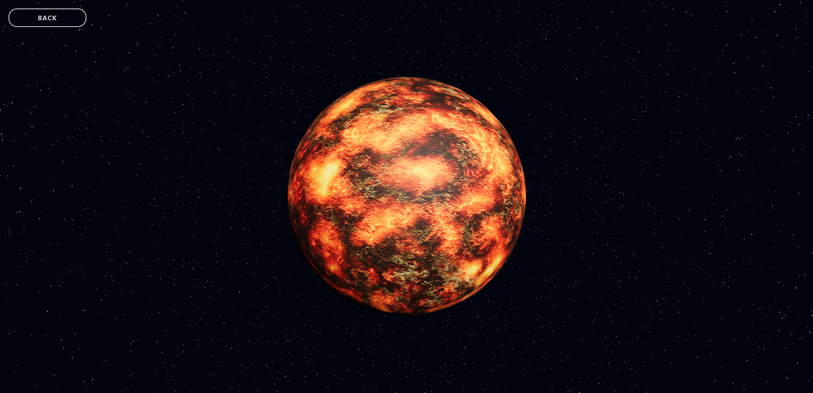
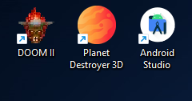
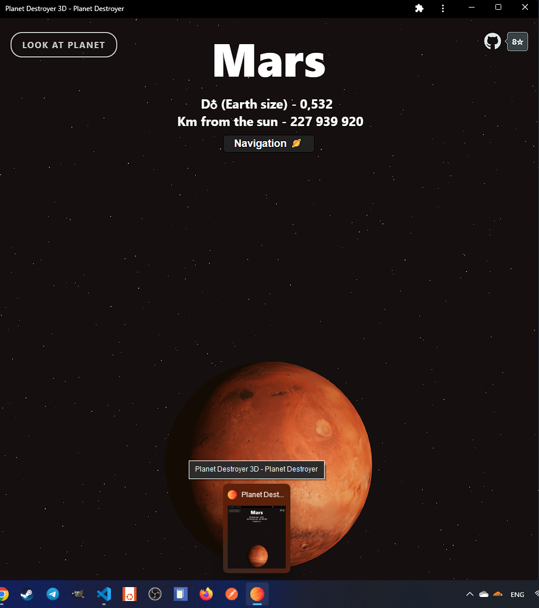
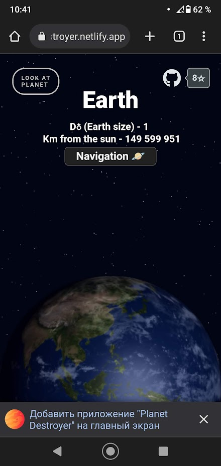
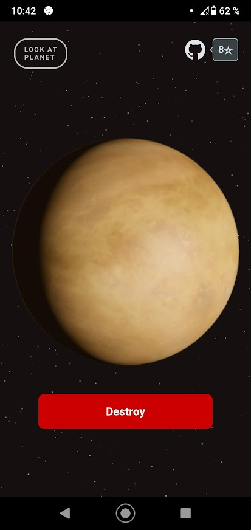

<h1 align='center'> 3D Planets destroyer 🌏</h1>
<h3 align='center'>Project with very tricky animated transition and 3D support that can help you visualize our solar system in details ☀️, and even zoom on the planets (textures from NASA)</h3>
 

 

<h2 align='center'>Videos about 3D in this website:</h2>
 

### EN 🌝 [YouTube video - "I created sun"](https://www.youtube.com/watch?v=DbWTAG9pBoU)

### RU 🌚 [Видео на YouTube - Создаём Плутон](https://www.youtube.com/watch?v=v73BxVUzjYQ)

 
<h1 align='center'>Examples</h1>

<h1 align='center'>PWA</h1>

## Todo

<ul>
<li><strike> Solar system planets with textures three.js ✔</strike>
<li><strike> transition router with animation ✔</strike>
<li><strike> Background filter in every image ✔</strike>
<li><strike> onClick top section hide? ✔</strike>
<li><strike> Pluto ✔</strike>
<li><strike> Sun ✔</strike>
<li><strike> Refactor DRY </strike>
<li><strike> Framer motion opacity </strike>
<li><strike> Earth atmosphere rotate like Venus </strike>
<li><strike> Responsive design for phone </strike>
<li><strike> TypeScript support to pages but not 3D </strike>

<li><strike> Down navigation bottom - mobile responsive (padding bottom more) </strike>
<li><strike> Check for some stepper (with router-DOM support) in left side? </strike>

</ul>

### Demo - https://planet-destroyer.netlify.app/